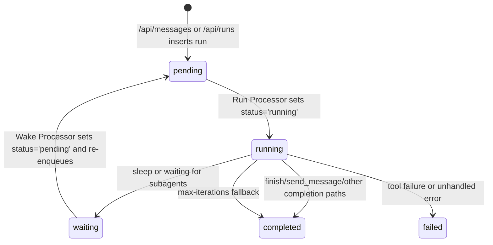

# Clifford Architecture (Code-Backed Spec)

## Summary
- The API creates **Runs** for inbound messages; Run Processor executes tool-aware, multi-step workflows.
- The Message Processor is a **direct chat** path, but the API does **not enqueue** message jobs today.
- Memory is **prompt assembly** from `memoryItems` and context history, not external retrieval/RAG.
- Run execution is a loop over JSON actions with explicit contracts; all state is persisted in `runs` and `run_steps`.

## Mode Selection: Direct Chat vs Run

**Source of truth:** `apps/api/src/routes/messages.ts`

- `/api/messages` always creates a **Run** for an inbound message when an enabled agent is found:
  - Inserts inbound `messages` row.
  - Creates `runs` row with `status: 'pending'`.
  - Updates the inbound message `metadata` to include `{ runId, kind: 'coordinator' }`.
  - Enqueues the run via `enqueueRun`.
- If **no enabled agent** is found, the API inserts an outbound error message and returns 500.

**Direct Chat path (Message Processor):**
- The worker has a `processMessage` implementation in `apps/worker/src/message-processor.ts` that handles message jobs from the `clifford-messages` queue.
- **There is no enqueue path in the API routes** that currently calls `enqueueMessage`. As a result, **direct chat is not used by `/api/messages`**.
- Inference: direct chat may be used by other job producers outside the API routes (none are present in this repo). If you expect direct chat, add a queue producer or expose a route that uses `enqueueMessage`.

**Hard rule:** In the current codebase, **tools are only available through Runs.** The Message Processor does not execute tools; it only does a single LLM call.

## Run Lifecycle State Machine

**Source of truth:** `apps/worker/src/run-processor.ts`, `apps/worker/src/wake-processor.ts`, `apps/api/src/routes/messages.ts`, `apps/api/src/routes/runs.ts`

### Status values written by code
- `pending` (created or re-queued): `apps/api/src/routes/messages.ts`, `apps/api/src/routes/runs.ts`, `apps/worker/src/wake-processor.ts`
- `running`: `apps/worker/src/run-processor.ts`
- `waiting`: `apps/worker/src/run-processor.ts` (sleep or subagent waiting)
- `completed`: `apps/worker/src/run-processor.ts`
- `failed`: `apps/worker/src/run-processor.ts`

**Inference:** `cancelled` is referenced in the SSE endpoint (`apps/api/src/routes/runs.ts`) but no code sets this status in the repo.

### Persisted run fields (as read by API)
From `apps/api/src/routes/runs.ts`:
- `runs`: `id`, `agentId`, `channelId`, `userId`, `contextId`, `parentRunId`, `rootRunId`, `kind`, `profile`, `inputText`, `inputJson`, `outputText`, `allowedTools`, `wakeAt`, `wakeReason`, `status`, `createdAt`, `updatedAt`
- `run_steps`: full list for a run, ordered by `seq`

## Run Processor Execution Loop (High-Signal Summary)

**Source of truth:** `apps/worker/src/run-processor.ts`

- Each run is a loop with a hard cap: `config.runMaxIterations` (default `20` in `apps/worker/src/config.ts`).
- LLM output must be a **single JSON object** parsed by `parseRunCommand`.
- If parsing fails, the user gets a generic error and the run fails.
- For tool failures, retries are limited by:
  - Tool config `max_retries` if set, otherwise `config.runMaxToolRetries` (default `1`).
- The loop enforces a **planning gate**:
  - Before tool calls / output / finish, the model must emit `note(category="requirements")` and `note(category="plan")`.
  - If it doesn’t, the processor injects a system note and continues.
- If the loop stalls (no tool calls, no output, no assistant message), the processor will **force-finish** with a short fallback after `min(5, runMaxIterations - 1)` iterations.
- If `runMaxIterations` is reached, the processor completes with a fallback message rather than throwing an error.

## JSON Action Contract (Run Processor)

**Source of truth:** `apps/worker/src/run-processor.ts` (`RunCommand`, `SpawnCommand`, `parseRunCommand`)

### Command types

| type | Required fields | Effect | Loop continues? | Transcript entry | User-visible output |
| --- | --- | --- | --- | --- | --- |
| `tool_call` | `name`, `args?` | Execute tool call via ToolRegistry. Applies policy. | Yes | `tool_call` + `tool_result` | Only if tool result is later used to send/finish |
| `send_message` | `message` | Sends a message to user; may also finish run depending on conditions. | Often finishes (see below) | `assistant_message` | Yes |
| `set_output` | `output`, `mode?` | Updates `outputText` buffer (`replace`/`append`). | Yes | `output_update` | Not until `finish` |
| `finish` | `output?`, `mode?` | Finalizes run, sends output to user. | No | `finish` | Yes |
| `decision` | `content`, `importance?` | Records a decision in run steps. | Yes | `decision` | No |
| `note` | `category`, `content` | Records structured note in run steps. | Yes | `note` | No |
| `spawn_subagent` | `subagent` | Creates a subagent run and enqueues it. | Usually pauses (waiting) | `message` event `spawn_subagents` | Not directly |
| `spawn_subagents` | `subagents` | Creates multiple subagent runs and enqueues them. | Usually pauses (waiting) | `message` event `spawn_subagents` | Not directly |
| `sleep` | `wakeAt?` or `delaySeconds?` or `cron?` | Sets run to waiting and schedules wake/trigger. | No (run exits) | `message` event `sleep` | No |

### Tool-call shortcut JSON

If the model responds with a JSON object that has:
- `type: "<toolName.command>"`, or
- `name: "<toolName.command>"`,

then `parseRunCommand` treats it as a `tool_call` with `args` from `args`.

### `send_message` completion behavior

The Run Processor finishes after `send_message` if any of the following are true:
- It is a **subagent** run (always finishes).
- The message is identical to the previous assistant message.
- The message is a question (ends in `?` or matches `/bitte|please|could you|can you/i`).
- There were no tool calls or output updates and no prior output.
- Any tool has failed during this run (`toolFailureCounts.size > 0`).

## Memory, Context, and “RAG”

**Key clarification:** There is **no external retrieval system** wired into either processor. Memory is built from **stored `memoryItems` and message history** and injected into the prompt.

### Message Processor (Direct Chat)

**Source of truth:** `apps/worker/src/message-processor.ts`

Conversation assembly order:
1. `system` prompt from `settings.defaultSystemPrompt` or `DEFAULT_SYSTEM_PROMPT`.
2. `system` info lines: user name, channel type, context name.
3. Memory block if enabled.
4. Cross-channel context blocks (if enabled).
5. Recent message history in the current context.

Constants:
- History limit: `40` messages (local context).
- Cross-channel default limit: `CROSS_CHANNEL_MESSAGE_LIMIT = 12`.
- Memory load cap: `MEMORY_LOAD_CAP = 1200` characters.
- Memory per-level item cap: `MEMORY_PER_LEVEL_LIMIT = 5` items per level.
- Memory max chars per level: `MEMORY_LEVEL_LIMITS` (level 0..5).

**Compaction:**
- `config.maxTurnsPerContext` (default `60`) triggers compaction when exceeded.
- Compaction keeps the newest half of messages, deletes older half, and enqueues a `memory_write` job.
- Memory writer input is capped at `config.memoryWriterMaxMessages` (default `40`).

### Run Processor (Tool-Oriented)

**Source of truth:** `apps/worker/src/run-processor.ts`

The run payload for the LLM includes:
- `conversation`: message history (`loadConversation`), with limit `40` for subagents and no limit for coordinator.
- `memories`: active `memoryItems` for the user (no external retrieval).
- `transcript`: prior tool calls/results and notes.
- `subagents`: results from completed subagent runs.

**Inference:** The system prompt mentions `memory.search` and `memory.sessions`, but those are **tool calls**; there is no built-in retrieval mechanism in the processor itself.

## Data Flow Overview

### /api/messages → Run Processor

1. API inserts inbound `messages` row.
2. API creates `runs` row with `status: 'pending'`.
3. API updates inbound message `metadata` with `{ runId, kind: 'coordinator' }`.
4. API enqueues a `run` job.
5. Run Processor:
   - Loads run, sets `status: 'running'`.
   - Builds tool registry and tool config filters.
   - Calls LLM with system prompt + conversation + memory + transcript.
   - Executes tool calls and loop actions.
   - Sends outbound message via `sendRunMessage`, with `metadata: { source: 'run', runId, kind }`.

### Memory Write Flow (Context Compaction)

1. `updateContextAfterResponse` increments `contexts.turnCount`.
2. If `turnCount > config.maxTurnsPerContext`, compaction runs.
3. Older messages are deleted and a `memory_write` job is enqueued.
4. Memory writer produces JSON ops:
   - Schema: `{ op, id?, module?, key?, level?, value?, confidence? }`
   - Modules constrained by `MEMORY_MODULES`.
5. Ops are applied to `memoryItems` with per-level caps (`LEVEL_LIMITS`).

## Config/Constants Reference

**Source of truth:** `apps/worker/src/config.ts`, `apps/worker/src/message-processor.ts`

- `config.runMaxIterations`: default `20`
- `config.runTranscriptLimit`: default `50`
- `config.runTranscriptTokenLimit`: default `1200`
- `config.runMaxJsonRetries`: default `1`
- `config.runMaxToolRetries`: default `1`
- `config.maxTurnsPerContext`: default `60`
- `config.memoryWriterMaxMessages`: default `40`
- `DEFAULT_SYSTEM_PROMPT`: `'You are Clifford, a very skilled and highly complex AI-Assistent!'`
- `CROSS_CHANNEL_MESSAGE_LIMIT`: `12`
